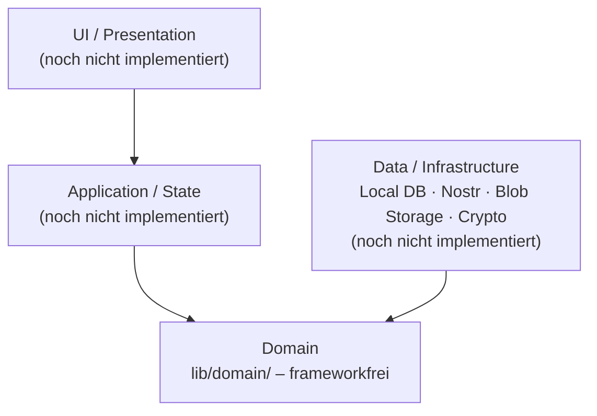
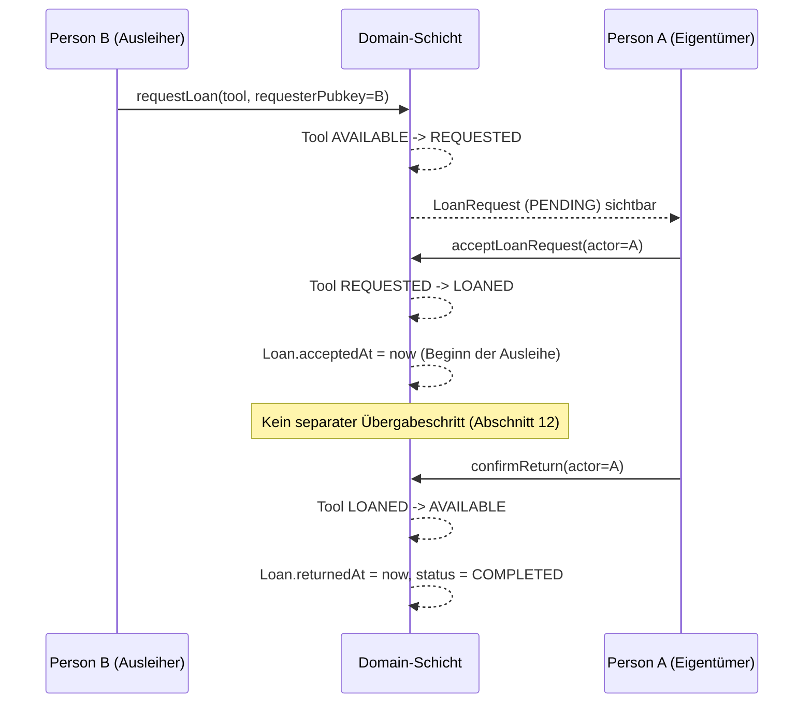

# Architektur – Werkzeugkiste

Status: **Domain-Schicht, Phase 3–7 der TDD-Pipeline abgeschlossen**
(Rot/Grün-Nachweis, Refactor, Mutationstest-Vorbereitung, Dokumentation –
siehe `reports/`). Application-, Infrastructure- und UI-Schicht folgen,
sobald die offenen ADRs (siehe `docs/adr/`) entschieden sind.

## Schichtenmodell (Lastenheft Abschnitt 36)

Die Domain-Schicht (`lib/domain/`) ist bewusst die einzige bisher
implementierte Schicht: Sie ist unabhängig von Flutter, SQLite, Nostr oder
konkreten Storage-Anbietern testbar (Abschnitt 35/36) und wird durch einen
CI-Import-Guard abgesichert (`.github/workflows/ci.yml`).

## Module der Domain-Schicht

| Datei | Verantwortung | Lastenheft-Bezug |
|---|---|---|
| `tool.dart` | `Tool`-Entität + State-Machine | Abschnitt 10 |
| `loan_request.dart` | `LoanRequest`-Entität + State-Machine | Abschnitt 11 |
| `loan.dart` | `Loan`-Entität, Rückgabe-Logik | Abschnitt 12–14 |
| `community.dart` | `Community`/`Member`-Entitäten | Abschnitt 7, 9 |
| `conflict_resolution.dart` | Deterministische Konfliktauflösung (Arbeitsannahme, ADR-04 offen) | Abschnitt 22 |
| `tool_service.dart` | Orchestrierende Use-Cases (requestLoan, acceptLoanRequest, confirmReturn, …) inkl. Berechtigungsprüfung | Abschnitt 10.1, 11.1, 14, 33 |
| `events.dart` | Fachliche Event-Typen (Skelett, konkrete Nostr-Bindung offen: ADR-01) | Abschnitt 38 |
| `exceptions.dart` | Domain-Fehlertypen | Abschnitt 33 |
| `state_machine.dart` | Generischer Zustandsautomaten-Baustein (seit Phase 5), gemeinsam genutzt von `tool.dart` und `loan_request.dart` | Abschnitt 10.2, 11.1 |
| `ids.dart` | Typdefinitionen für IDs/Pubkeys (Lesbarkeit, keine eigene Logik) | – |

## API-Übersicht: öffentliche Domain-Operationen

Alle zustandsverändernden Operationen liegen gebündelt in
`tool_service.dart` und sind reine Funktionen (keine Seiteneffekte, kein
IO) – Persistenz und Event-Versand sind Aufgabe der noch nicht
implementierten Application-/Infrastructure-Schicht:

- `updateTool(...)`, `deleteTool(...)` – nur durch den Eigentümer (Abschnitt 10.1).
- `requestLoan(...)` – erzwingt Tool-State-Machine und die Regel „max. eine
  aktive Anfrage pro Werkzeug" (REQ-249, Abschnitt 11.1).
- `acceptLoanRequest(...)`, `rejectLoanRequest(...)` – nur durch den
  Eigentümer.
- `cancelLoanRequest(...)` – nur durch den Anfragenden.
- `confirmReturn(...)` – nur durch den Eigentümer, setzt `Loan.returnedAt`
  und schließt den Leihvorgang ab (Abschnitt 14).

Jede dieser Funktionen wirft ausschließlich Subtypen von
`DomainException` (`InvalidStateTransition`, `PermissionDenied`,
`DuplicateActiveLoanRequest`, `InvalidDomainData`) – nie rohe
`StateError`/`ArgumentError` (Abschnitt 33).

## Sequenzdiagramm: Leihvorgang (Akzeptanzszenario Abschnitt 48)

## Architekturentscheidungen (ADRs)

Alle acht vom Lastenheft (Abschnitt 47) geforderten ADRs sind formal unter
`docs/adr/` dokumentiert:

| ADR | Thema | Status |
|---|---|---|
| [ADR-01](adr/0001-nostr-event-modell.md) | Nostr Event-Modell | Vorschlag (wartet auf Bestätigung) |
| [ADR-02](adr/0002-community-verschluesselung.md) | Community-Verschlüsselung | Vorschlag (wartet auf Bestätigung) |
| [ADR-03](adr/0003-invite-system.md) | Invite-System | Vorschlag (wartet auf Bestätigung) |
| [ADR-04](adr/0004-konfliktaufloesung.md) | Konfliktauflösung | Entschieden, implementiert + getestet |
| [ADR-05](adr/0005-foto-storage.md) | Foto-Storage | **Entschieden** (komplett lokal, Verteilung an alle) |
| [ADR-06](adr/0006-backup-recovery.md) | Backup/Recovery | Vorschlag (wartet auf Bestätigung; hohes Risiko laut Abschnitt 46) |
| [ADR-07](adr/0007-lokale-datenbank.md) | Lokale Datenbank | Vorschlag (wartet auf Bestätigung) |
| [ADR-08](adr/0008-relay-blob-storage-betrieb.md) | Relay-Betrieb (Blob-Storage-Teil durch ADR-05 entfallen) | Vorschlag (wartet auf Bestätigung) |

Nur ADR-04 (Konfliktauflösung) hat bereits konkrete Code-Konsequenzen;
die übrigen betreffen ausschließlich die noch nicht implementierte
Application-/Infrastructure-Schicht (siehe jeweilige ADR-Datei für die
genaue Abgrenzung). Sieben der acht ADRs liegen als konkrete, technisch
begründete Vorschläge vor (September 2026) und warten auf die formale
Bestätigung durch den Auftraggeber – nur ADR-05 ist bereits final
entschieden.
