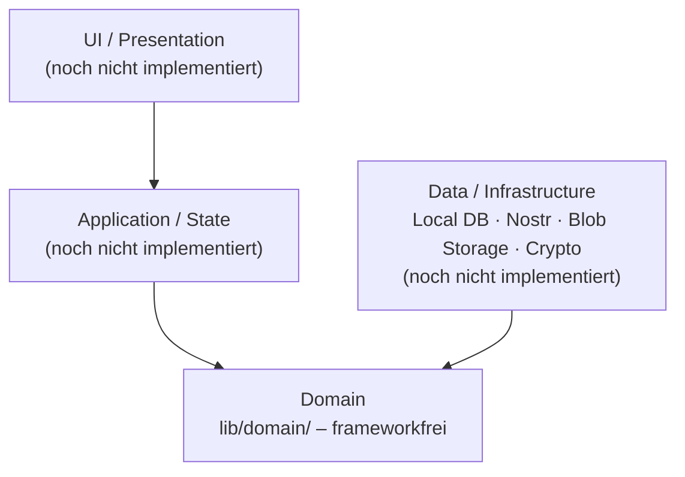
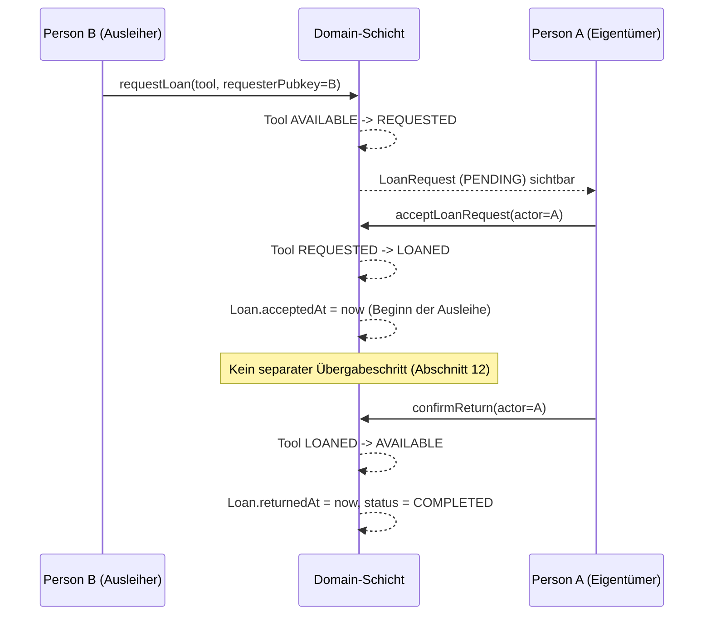

# Architektur – Werkzeugkiste

Status: **Domain-Schicht (Phase 3/4 der TDD-Pipeline)**. Application-,
Infrastructure- und UI-Schicht folgen, sobald die offenen ADRs (siehe
`pipeline/00_offene_fragen.md`, Abschnitt 47 des Lastenhefts) entschieden
sind. Dieses Dokument wird in Phase 7 der Pipeline vervollständigt.

## Schichtenmodell (Lastenheft Abschnitt 36)

Die Domain-Schicht (`lib/domain/`) ist bewusst die einzige bisher
implementierte Schicht: Sie ist unabhängig von Flutter, SQLite, Nostr oder
konkreten Storage-Anbietern testbar (Abschnitt 35/36) und wird durch einen
CI-Import-Guard abgesichert (`.github/workflows/ci.yml`).

## Module der Domain-Schicht

| Datei | Verantwortung | Lastenheft-Bezug |
|---|---|---|
| `tool.dart` | `Tool`-Entität + State-Machine | Abschnitt 10 |
| `loan_request.dart` | `LoanRequest`-Entität + State-Machine | Abschnitt 11 |
| `loan.dart` | `Loan`-Entität, Rückgabe-Logik | Abschnitt 12–14 |
| `community.dart` | `Community`/`Member`-Entitäten | Abschnitt 7, 9 |
| `conflict_resolution.dart` | Deterministische Konfliktauflösung (Arbeitsannahme, ADR-04 offen) | Abschnitt 22 |
| `tool_service.dart` | Orchestrierende Use-Cases (requestLoan, acceptLoanRequest, confirmReturn, …) inkl. Berechtigungsprüfung | Abschnitt 10.1, 11.1, 14, 33 |
| `events.dart` | Fachliche Event-Typen (Skelett, konkrete Nostr-Bindung offen: ADR-01) | Abschnitt 38 |
| `exceptions.dart` | Domain-Fehlertypen | Abschnitt 33 |

## Sequenzdiagramm: Leihvorgang (Akzeptanzszenario Abschnitt 48)

## Offene ADRs

Siehe `pipeline/00_offene_fragen.md` und `pipeline/01_requirements.json`
(Quelle „47") für den vollständigen Stand der acht offenen ADRs
(ADR-01 … ADR-08). Diese Domain-Implementierung trifft für ADR-04
(Konfliktauflösung) eine dokumentierte Arbeitsannahme (Last-Writer-Wins +
Tiebreak), ersetzt aber nicht die formale Entscheidung.
